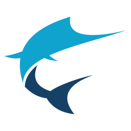

# Swordfish



Swordfish is a CAT (Computer-Aided Translation) tool built around XLIFF, providing a unified workflow to translate and manage multilingual content across multiple file formats.

If your workflow revolves around XLIFF and interoperability between tools, Swordfish provides a consistent environment to manage translation end-to-end.

---

## Typical workflow

1. Open or import files (or translation packages)
2. Translate content using the built-in editor and translation tools
3. Leverage Translation Memory and Machine Translation suggestions
4. Export translated files or generate return packages

---

## Why Swordfish

- Uses XLIFF as a core format for consistent and interoperable workflows
- Integrates with other CAT tools and localization systems through XLIFF-based workflows
- Supports multiple file formats through a unified translation process
- Handles package-based workflows (e.g., Trados Studio)

---

## Installation

Download ready-to-use installers (recommended for most users):

👉 <https://www.maxprograms.com/downloads/index.html>

---

## Building from source

### Requirements

- JDK 21 or newer (<https://adoptium.net/>)
- Gradle 9.2.1 or newer (<https://gradle.org>)
- Node.js 24.11.1 LTS or newer (<https://nodejs.org/>)

### Build steps

```bash
git clone https://github.com/maxprograms-com/Swordfish.git
cd Swordfish
gradle
npm install
npm start
```

After the initial build, you can run:

```bash
npm start
```

to launch Swordfish.

---

## Videos

- Build from source:  <https://youtu.be/xiHFxfqCleQ>
- Translate using AI Prompt Dialog: <https://youtu.be/8S420n2QieM>
- Translate using AI menu or shortcuts: <https://youtu.be/FwsFZCjUajU>

---

## Source code and subscriptions

Swordfish source code is available on GitHub and can be downloaded, compiled, modified, and used free of charge.

We offer subscriptions that include installers, technical support, bug fixes, and feature requests. Subscription fees support ongoing development and help maintain the quality and reliability of Swordfish.

The version included in the official installers can be used with a free 30-day trial by requesting an evaluation key. After the trial period expires, a subscription is required.

Subscription keys are available from the Maxprograms Online Store and cannot be shared or transferred between machines.

Subscription version includes unlimited email support at [tech@maxprograms.com](mailto:tech@maxprograms.com).

---

## Differences summary

| Differences | Source Code | Subscription Based |
| ----------- | :---------: | :----------------: |
| Ready-to-use installers | No | Yes |
| Notarized macOS launcher | No | Yes |
| Signed Windows installer | No | Yes |
| Restricted features | None | None |
| Technical support | Peer support at <https://groups.io/g/maxprograms/> | Email + peer support |

---

## Related projects

- <https://github.com/rmraya/RemoteTM>
- <https://github.com/rmraya/OpenXLIFF>

---

## Legal

License information for all included components is available in the `licenses` directory.
